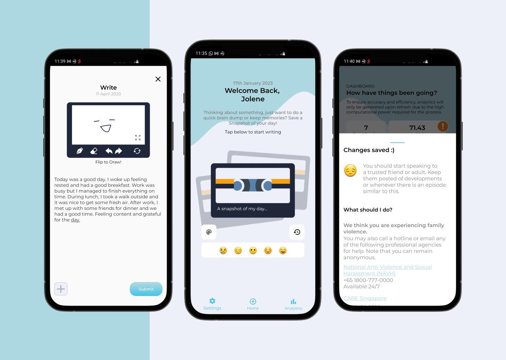
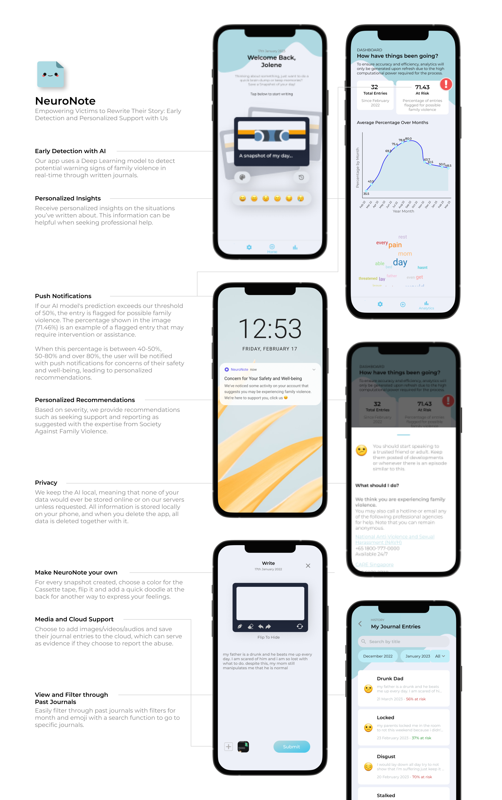

# NeuroNote Mobile App
A Mobile Application with SQLiteOpenHelper as the local database. 

We incorporated AI to help identify younger victims in the early stage of family violence. Since this is an ongoing partnership with Society Agasint Family Violence (SAFV), I wouldn't be able to share the code.

 

I led my team of 3 where they focused on other areas building the AI model and the cloud implementation side of things. My Role in the project was the Lead Software Engineer where I built the mobile app.

Date: Development started in June 2022 
Live Demo: Currenty there's no live demo, but we're looking to bring it to beta testing soon

## How it Works

This is a quick overview of what was implemented in the app
- Base App Development
    - Saving Journals to the Database
    - File Upload, File Preview and Saving to Database
    - Dialogs and BottomFragments to return output of model/recommendations for youths.
    - Dark Mode, Toggling AI with SharedPreferences
    - Bottom Navigation Bars -> Working with Fragments and Activities
    - Used SQLiteOpenHelper for local database
- Integrated a model.tflite file into the Android App (with tokenizing and padding text in Kotlin)
    - Text Cleaning in Kotlin -> Remove stopwords, Removed Punctuation, Case Normalization, Replacing Abbreviations and finally Lemmatization
- Advanced Android Add Ons
    - Push Notifications
    - Canvas Drawing with the app
    - Line Graphs, Word Clouds etc.

## Notes
Since this is an ongoing project, we are still working on fine tuning the app according to users from our user testing. There are also plans to widen the target audience to not only identifying Family Violence but also expanding to youths at risk in general as many issues could be overlapping as discussed with SAFV.

## Contact
Jolene - [jolenechong7@gmail.com](mailto:jolenechong7@gmail.com)  