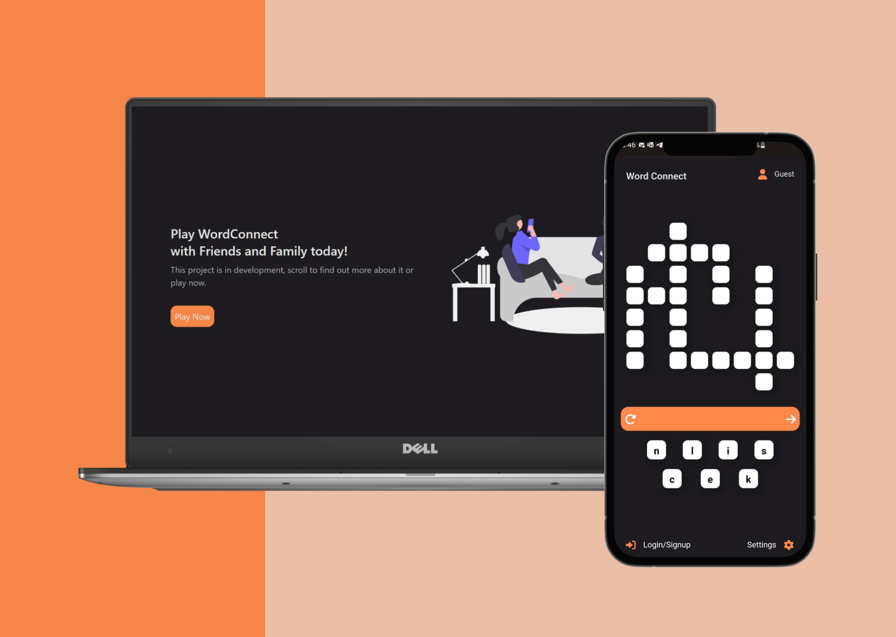
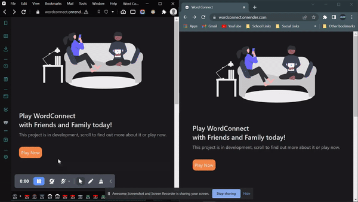
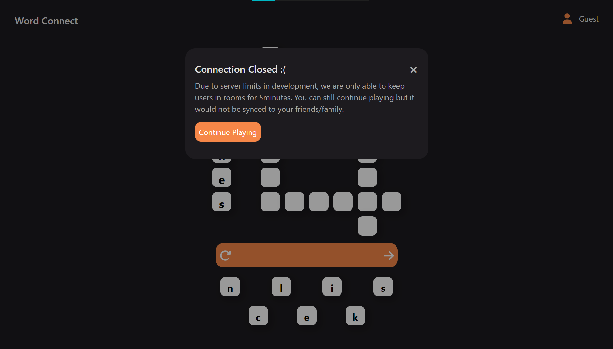

# Word Connect
I wanted to experiment with websockets. Started this project quite awhile ago so its mostly with SCSS styling but added tailwind recently, also went back to reformat some of the code with react contexts.
 

 

Basically just Word Connect on its own, similar to Shopee Words. My family plays it a lot so i wanted to do something similar but make it collaborative and on the web instead.

## What I Did
- MERN Application with WebSockets
- SCSS and Tailwind (mostly built with SCSS)
- Has JWT Authentication with Verify.ts for middleware
- Algorithm to generate word connect matrixes built with backtracking algorithm
- Words that are used in the algorithm cleaned and categorised from https://github.com/dwyl/english-words

## How it Works
 

On the left we can see that the user is signed in while on the right the user is not. 
- When signed in, they can keep track of the number of puzzles they've completed nd not do the same puzzle again
- User 1 (left) starts a session and creates a room. 
- Unfortunately due to the free plan limitations of Render.com, WebSockets only remain open for 5 minutes.
- User 1 shares the link with User 2
- They are both now in the same room and can play together
- Incorrect words cause the words to vibrate and the key panel to turn red as indication
- Correct words are then mirrored to everyone in that room

When the session ends, this would be shown to users

 
Then, they can also continue playing the game on their own.

## Contact
Jolene - [jolenechong7@gmail.com](mailto:jolenechong7@gmail.com)  
